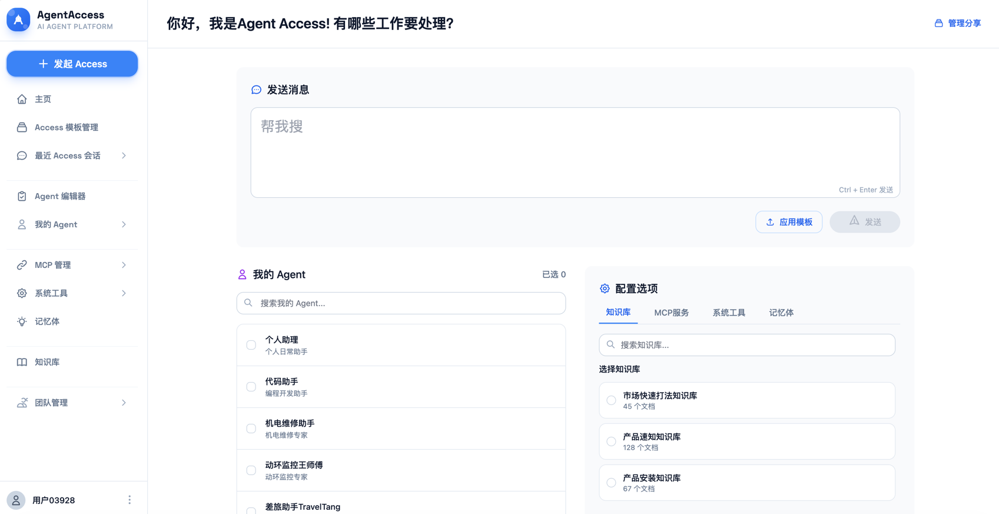
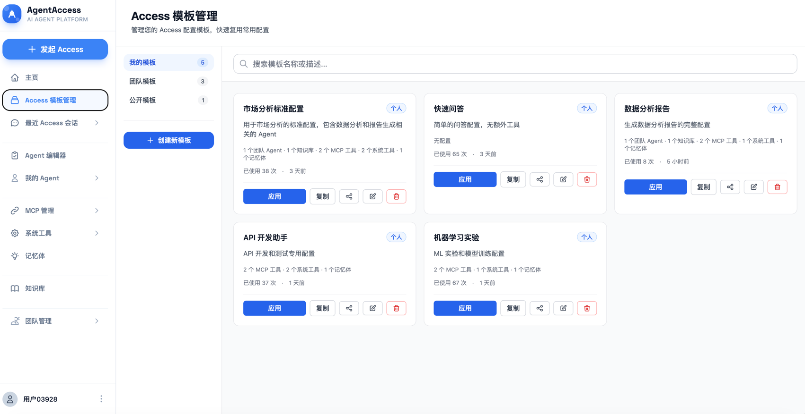
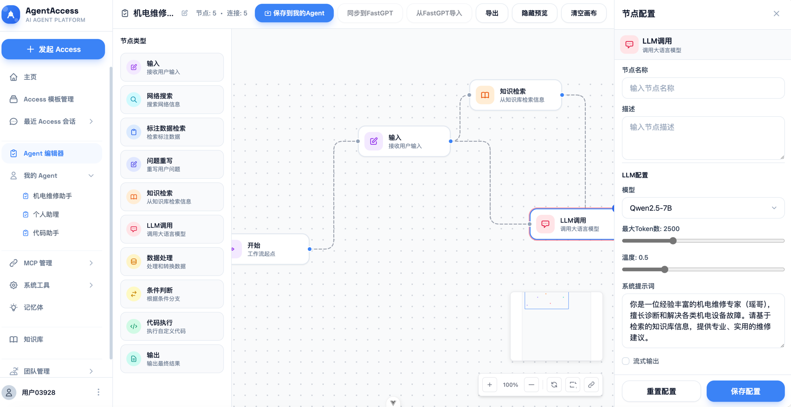
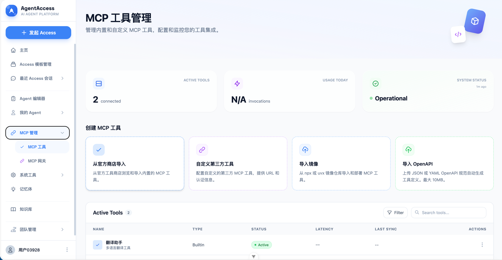
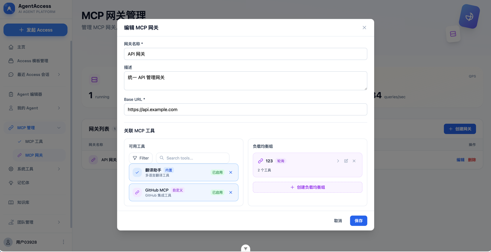
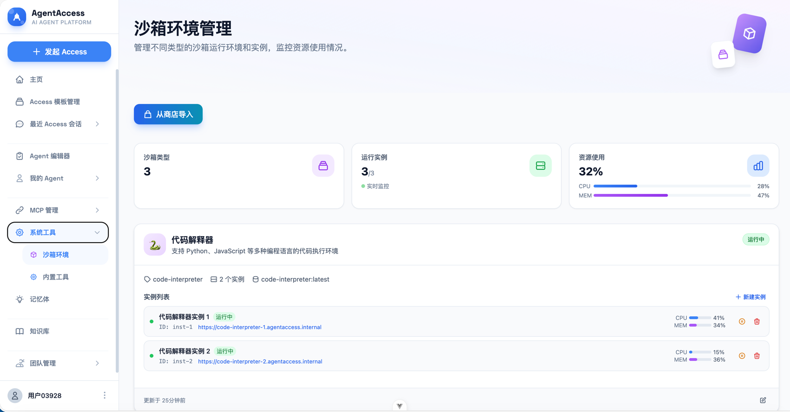
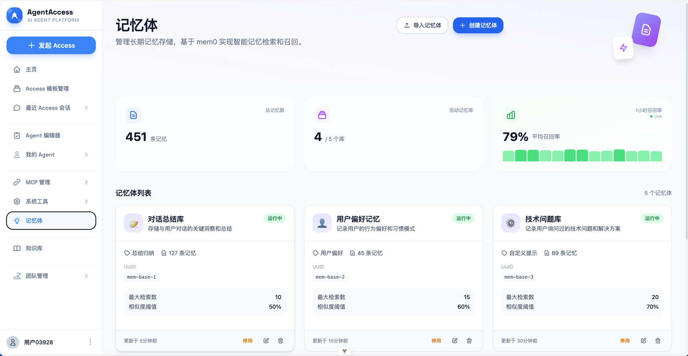
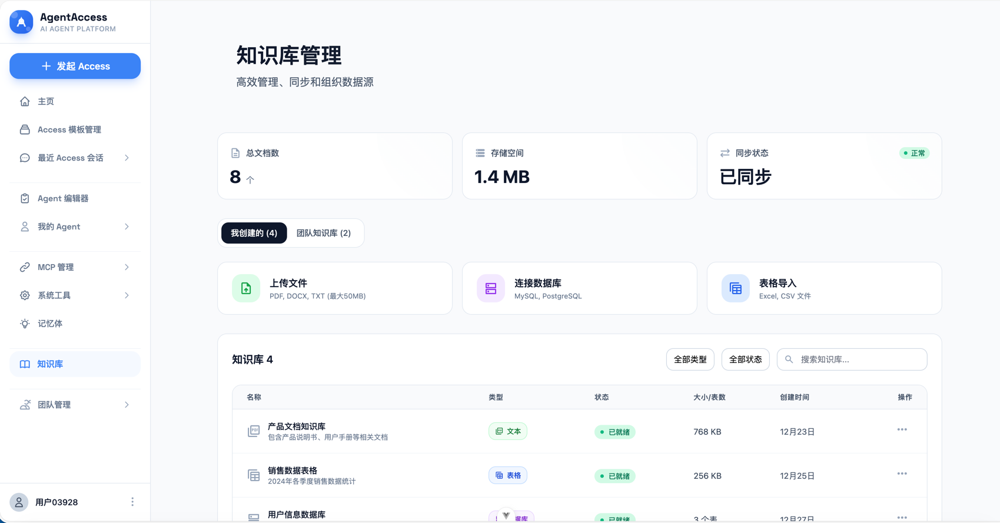

# AgentAccess

<div align="center">

一个功能强大的 AI Agent 管理平台，提供统一的访问控制、工作流编辑器、工具管理和知识库集成。

[](https://vuejs.org/)
[](https://www.typescriptlang.org/)
[](https://tailwindcss.com/)
[](https://vitejs.dev/)

[在线演示](https://rickyrelive.github.io/agentAccess/) • [快速开始](#快速开始) • [功能特性](#功能特性)

</div>

---

## ✨ 功能特性

### 🔐 Access 会话管理
- 支持创建和管理多个 AI Agent 会话
- 灵活的会话配置和模板系统
- 实时会话状态监控

### 📋 Access 模板
- 预置多种场景模板（个人、团队、公开）
- 支持自定义模板创建和分享
- 模板权限管理和访问控制

### 🔄 AgentFlow 工作流
- 可视化工作流编辑器
- 拖拽式节点连接
- 支持多种节点类型（输入、LLM 调用、数据处理、条件分支等）
- 工作流测试和调试功能
- 支持 FastGPT 工作流导入

### 🛠️ 工具管理
#### MCP Tools
- 内置工具库集成
- 自定义第三方工具配置
- 工具状态监控和管理
- 支持 npx/uvx 镜像导入
- OpenAPI 规范自动生成工具

#### MCP Gateways
- 统一 API 网关管理
- 负载均衡配置
- 健康检查和故障转移
- 网关性能监控

#### Sandbox 沙箱环境
- 代码解释器（Python、JavaScript）
- Browser 自动化
- 终端命令执行
- 资源使用监控

#### Memory 记忆管理
- 多个记忆库创建和管理
- 记忆导入/导出
- 记忆检索和召回率统计

#### 📚 知识库
- 文本导入支持
- Excel/CSV 表格导入
- 数据库连接导入
- 向量化嵌入配置
- 知识库检索和测试

---

## 🚀 快速开始

### 环境要求

- Node.js ^20.19.0 || >=22.12.0
- npm 或 pnpm

### 安装

```bash
# 克隆项目
git clone https://github.com/rickyrelive/agentAccess.git
cd agentAccess

# 进入前端目录
cd agentaccess-frontend

# 安装依赖
npm install
```

### 开发

```bash
# 启动开发服务器
npm run dev

# 访问 http://localhost:5173
```

### 构建

```bash
# 类型检查 + 构建
npm run build

# 仅构建（跳过类型检查）
npm run build-only
```

### 预览

```bash
npm run preview
```

---

## 📁 项目结构

```
agentaccess-frontend/
├── src/
│   ├── assets/          # 静态资源
│   ├── components/       # Vue 组件
│   │   ├── access-template/    # Access 模板相关组件
│   │   ├── knowledge-base/      # 知识库相关组件
│   │   ├── layout/             # 布局组件
│   │   ├── mcp-management/     # MCP 工具和网关管理
│   │   ├── memory-management/  # 记忆管理
│   │   ├── sandboxed-env/      # 沙箱环境
│   │   ├── settings/           # 设置页面
│   │   ├── team-agents/        # 团队 Agents
│   │   └── workflow/           # 工作流编辑器
│   ├── router/          # 路由配置
│   ├── stores/          # Pinia 状态管理
│   ├── types/           # TypeScript 类型定义
│   └── utils/           # 工具函数
├── public/              # 公共资源
└── index.html           # HTML 入口
```

---

## 🛠️ 技术栈

- **框架**: Vue 3.5 (Composition API)
- **语言**: TypeScript 5.9
- **构建工具**: Vite 7.2
- **状态管理**: Pinia 3.0
- **路由**: Vue Router 4.6
- **样式**: Tailwind CSS 3.4
- **数据库**: SQL.js (浏览器端 SQLite)
- **UI 组件**: Headless UI + Heroicons
- **拖拽**: vue-draggable-plus
- **工具库**: VueUse, Axios

---

## 📸 界面预览

### Access 会话


### Access 模板管理


### AgentFlow 工作流编辑器


### MCP 工具管理


### MCP 网关管理


### 沙箱环境


### 记忆管理


### 知识库


---

## 🔧 配置说明

### 模型提供商配置

在 **设置 > 模型配置** 中添加您的 API Provider：

- **OpenAI**: 需要 API Key 和 Base URL
- **Anthropic**: 需要 API Key
- **Ollama**: 本地部署的 Ollama 地址
- **自定义**: 支持兼容 OpenAI API 的任何服务

### MCP 工具配置

支持多种方式添加 MCP 工具：

1. **官方商店导入**: 从预置工具库直接导入
2. **自定义第三方工具**: 配置 URL 和认证信息
3. **镜像导入**: 从 npx 或 uvx 仓库导入
4. **OpenAPI 导入**: 上传 JSON/YAML 规范自动生成

### 知识库配置

支持多种数据源导入：

- **文本文件**: txt, md, pdf 等
- **电子表格**: Excel, CSV
- **数据库**: MySQL, PostgreSQL 等关系型数据库

---

## 🤝 贡献指南

欢迎提交 Issue 和 Pull Request！

1. Fork 本仓库
2. 创建特性分支 (`git checkout -b feature/AmazingFeature`)
3. 提交更改 (`git commit -m 'Add some AmazingFeature'`)
4. 推送到分支 (`git push origin feature/AmazingFeature`)
5. 开启 Pull Request

---

## 📄 许可证

MIT License

---

## 🔗 相关链接

- [Vue 3 文档](https://vuejs.org/)
- [Vite 文档](https://vitejs.dev/)
- [Tailwind CSS 文档](https://tailwindcss.com/)
- [Pinia 文档](https://pinia.vuejs.org/)
- [MCP 协议](https://modelcontextprotocol.io/)

---

<div align="center">

**Built with ❤️ by Ricky**

</div>
